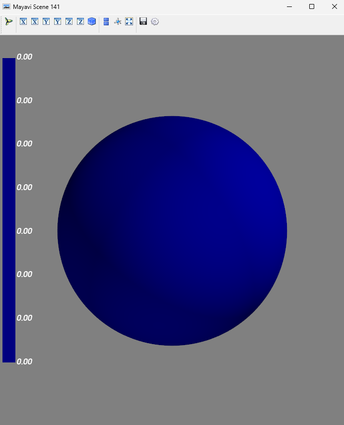
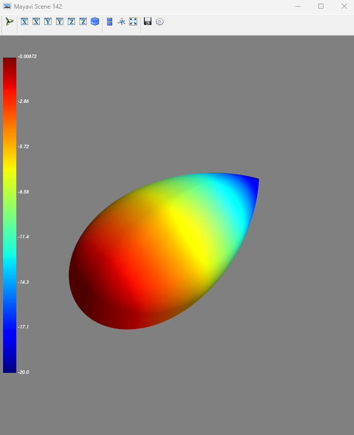
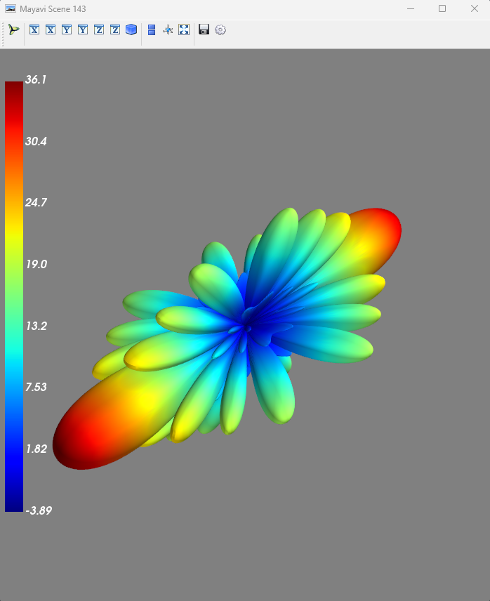

# plot_3d_radiation_pattern
Pythonで3dアンテナパターンを描画する

## 事前準備
mayaviというライブラリをインストールしておくこと
https://mayavi.readthedocs.io/ja/latest/

## 実行手順
plot_test.pyを実行すると、以下のアンテナパターンを描画する。
- オムニアンテナ
- TR38.901 8.5.1節 BS antennaで規定される指向性アンテナ
- sn.channel.tr38901.AntennaArrayで定義した8*8のアレーアンテナ

## 実行結果
オムニアンテナ

TR38.901 8.5.1節 BS antennaで規定される指向性アンテナ

sn.channel.tr38901.AntennaArrayで定義した8*8のアレーアンテナ
